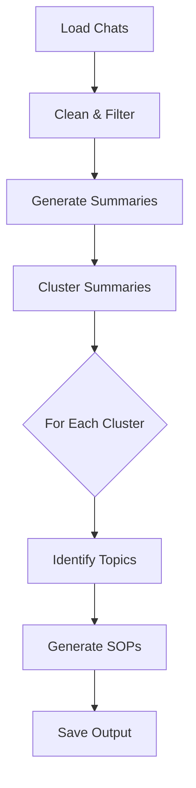

# High Level Design

## Architecture Overview

Process: Chat Data → Clean → Summarize → Cluster → Generate SOPs

### Core Components

1. **Data Models** (`models.py`)
   - `Message`: Single chat message (customer/agent roles)
   - `Conversation`: Complete chat session with messages
   - `ConversationCluster`: Group of similar conversations
   - `SOP`: Generated Standard Operating Procedure

2. **Data Pipeline**
   - Loader: Parse chat data (JSON/CSV) into models
   - Preprocessor: Clean and normalize text
   - Filter: Remove noise, duplicates, PII (future)

3. **Analysis**
   - Summarize conversations
   - Cluster by similarity (HDBSCAN + embeddings)
   - Identify key topics per cluster

4. **SOP Generation**
   - Create structured SOPs from clusters
   - Include relevant examples
   - Generate multiple formats (Markdown/HTML)

## Implementation Status

✅ **Data Models**
- Basic conversation structure
- Message types and roles
- SOP document format

⏳ **Next Up**
1. Data loader for chat format
2. Text preprocessing pipeline
3. Basic clustering implementation

## Processing Flow

## Technical Considerations

### Performance
- Batch processing
- Caching of embeddings and intermediate results
- Parallel processing where applicable

### Frameworks
- Use langchain for LLM integration
- Consider using Langchain for caching LLM results and embeddings

### Quality Control
- Logging and monitoring
- Human validation points: cluster topics, SOP content

### Extensibility
- Plugin architecture for input/output formats (future feature)
- Configurable LLM providers
- Template-based output generation (future feature)

## Non-Goals
- Updating existing SOPs
- Real-time processing
