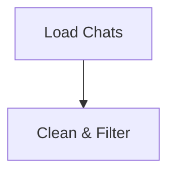

# High Level Design

## Architecture Overview

Process: Chat Data → Clean → Summarize → Cluster → Generate SOPs

### Core Components

1. **Data Models** (`models.py`)
   - `Message`: Single chat message (customer/agent roles)
   - `Conversation`: Complete chat session with messages
   - `Outcome`: Chat outcome (e.g., resolved, escalated)

2. **Main components**
   - Customer
   - Agent
   - ConversationRunner

3. **Simulation techniques**
   - Fine-tuned LLMs
   - RAG using existing chats as context

4. **Simulators**
   - CustomerSimulator - base class
   - AgentSimulator - base class

## Processing Flow

## Technical Considerations

### Performance
- Async LLM calls
- Caching of LLM calls
- Parallel chat execution

### Frameworks
- Use langchain for LLM integration
- Consider using Langchain for caching LLM results and embeddings

### Quality Control
- Logging and monitoring
- Human validation points: simulated chats

### Extensibility
- Plugin architecture for input/output formats (future feature)
- Configurable LLM providers
